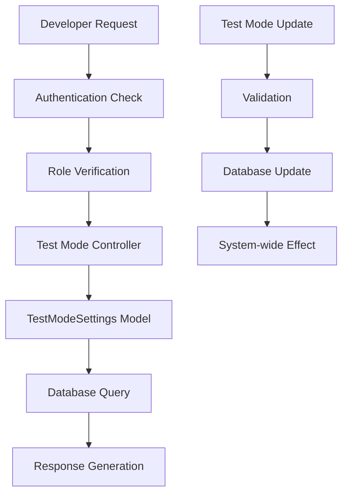
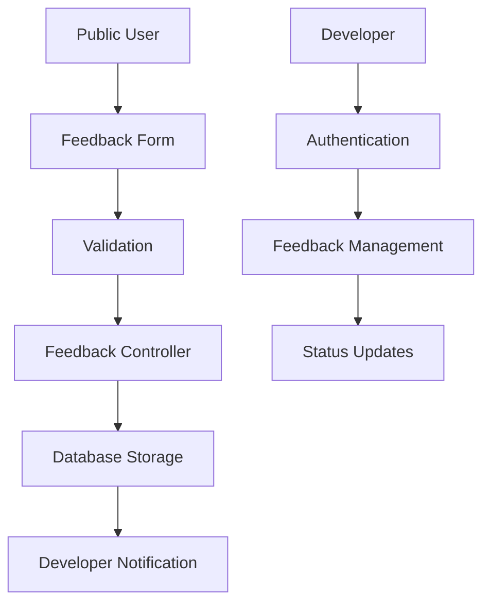
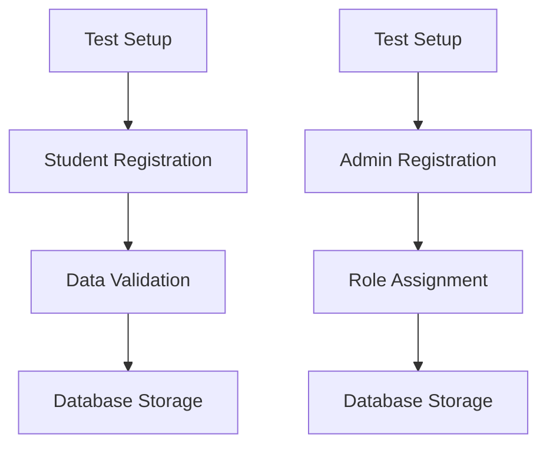

# Test Mode Implementation Documentation

## Overview

The Test Mode implementation is a comprehensive feature flag system integrated into the Registrar ODR (Online Document Request) system. It provides developers with the ability to control system behavior for testing purposes, enable feedback collection, and manage test data without affecting production operations.

## Table of Contents

1. [Purpose and Functionality](#purpose-and-functionality)
2. [Database Schema](#database-schema)
3. [Backend Implementation](#backend-implementation)
4. [API Endpoints](#api-endpoints)
5. [Data Flow and Integration](#data-flow-and-integration)

## Purpose and Functionality

### Primary Objectives

- **Feature Flag Control**: Enable/disable test mode functionality across the system
- **Feedback Collection**: Allow anonymous feedback submission during testing phases
- **Test Data Management**: Enable creation of test student and admin accounts
- **System Isolation**: Provide controlled environment for testing without production impact

### Key Features

1. **Global Test Mode Toggle**
   - Single boolean flag controls test mode state
   - Accessible only to developer role users
   - Immediate system-wide effect when changed

2. **Anonymous Feedback System**
   - Public endpoint for feedback submission
   - No authentication required (when test mode is active)
   - Support for multiple feedback types
   - Developer management interface

3. **Test Registration System**
   - Create test student accounts programmatically
   - Create test admin accounts with specified roles
   - Validation and data integrity checks
   - Developer-only access for management

4. **Comprehensive Logging**
   - All test mode activities are logged
   - Debug and monitoring support
   - Audit trail for compliance

## Database Schema

### Core Tables

#### `open_request_restriction` Table (Modified)

```sql
CREATE TABLE IF NOT EXISTS open_request_restriction (
    id SERIAL PRIMARY KEY,
    start_time TIME NOT NULL,
    end_time TIME NOT NULL,
    available_days JSONB NOT NULL,
    announcement TEXT DEFAULT '',
    test_mode BOOLEAN DEFAULT FALSE  -- NEW: Test mode flag
);
```

**Key Columns:**
- `test_mode` (BOOLEAN): Primary control flag for test mode functionality
- Default value: `FALSE` (production mode)

#### `feedback` Table

```sql
CREATE TABLE IF NOT EXISTS feedback (
    feedback_id SERIAL PRIMARY KEY,
    name VARCHAR(100) NOT NULL,
    email VARCHAR(100) NOT NULL,
    feedback_type VARCHAR(50) NOT NULL CHECK (feedback_type IN ('Bug Report', 'Feature Request', 'General Feedback')),
    description TEXT NOT NULL,
    steps_to_reproduce TEXT,
    submitted_at TIMESTAMP DEFAULT NOW(),
    status VARCHAR(20) DEFAULT 'NEW' CHECK (status IN ('NEW', 'IN PROGRESS', 'RESOLVED', 'CLOSED'))
);
```

**Key Features:**
- Supports three feedback types with specific validation
- Optional steps_to_reproduce for bug reports
- Status tracking for feedback management
- Timestamp tracking for submission analysis


#### `students` Table (Extended for Testing)

```sql
CREATE TABLE IF NOT EXISTS students (
    student_id VARCHAR(20) PRIMARY KEY,
    full_name VARCHAR(100) NOT NULL,
    contact_number VARCHAR(20),
    email VARCHAR(100),
    liability_status BOOLEAN DEFAULT FALSE,
    firstname VARCHAR(50) NOT NULL,
    lastname VARCHAR(50) NOT NULL,
    college_code VARCHAR(20),
    is_test_origin BOOLEAN DEFAULT FALSE  -- NEW: Track test-originated records
);
```

#### `admins` Table (Extended for Testing)

```sql
CREATE TABLE IF NOT EXISTS admins (
    email VARCHAR(100) PRIMARY KEY,
    role VARCHAR(50) NOT NULL,
    profile_picture VARCHAR(500),
    is_test_origin BOOLEAN DEFAULT FALSE  -- NEW: Track test-originated records
);
```

#### `test_students` Table

```sql
CREATE TABLE IF NOT EXISTS test_students (
    student_id VARCHAR(20) PRIMARY KEY,
    full_name VARCHAR(100) NOT NULL,
    contact_number VARCHAR(20),
    email VARCHAR(100),
    liability_status BOOLEAN DEFAULT FALSE,
    firstname VARCHAR(50) NOT NULL,
    lastname VARCHAR(50) NOT NULL,
    college_code VARCHAR(20),
    created_at TIMESTAMP DEFAULT NOW(),
    updated_at TIMESTAMP DEFAULT NOW()
);
```

**Purpose:** Isolated test student data that can be transferred to main tables when test mode is activated.

#### `test_admins` Table

```sql
CREATE TABLE IF NOT EXISTS test_admins (
    email VARCHAR(100) PRIMARY KEY,
    role VARCHAR(50) NOT NULL,
    profile_picture VARCHAR(500),
    created_at TIMESTAMP DEFAULT NOW(),
    updated_at TIMESTAMP DEFAULT NOW()
);
```

**Purpose:** Isolated test admin data that can be transferred to main tables when test mode is activated.

### Indexes and Performance

```sql
-- Feedback table indexes for fast lookups
CREATE INDEX IF NOT EXISTS idx_feedback_submitted_at ON feedback(submitted_at DESC);

-- Test mode is part of existing primary key constraint on open_request_restriction
```

## Backend Implementation

### Models


#### `TestModeSettings` Class

**Location**: `app/admin/developers/models.py`

**Purpose**: Core model for managing test mode state with automatic data management and enhanced validation

**Enhanced Methods:**

- `transfer_test_data()`: Automatically transfers all data from test tables to main tables when test mode is activated
- `cleanup_test_origin_data()`: Removes test-originated records from main tables when test mode is deactivated  
- `validate_student_id_uniqueness()`: Validates student ID uniqueness across both students and test_students tables
- `validate_email_uniqueness()`: Validates email uniqueness across all admin-related tables

```python
class TestModeSettings:
    @staticmethod
    def get_test_mode():
        """Get current test mode setting."""
        conn = g.db_conn
        cur = conn.cursor()
        try:
            cur.execute("SELECT test_mode FROM open_request_restriction WHERE id = 1")
            row = cur.fetchone()
            return bool(row[0]) if row else False
        except Exception as e:
            print(f"Error fetching test mode: {e}")
            return False
        finally:
            cur.close()

    @staticmethod
    def update_test_mode(test_mode):
        """Update test mode setting with automatic transfer or cleanup."""
        conn = g.db_conn
        cur = conn.cursor()
        try:
            # Get current test mode state
            cur.execute("SELECT test_mode FROM open_request_restriction WHERE id = 1")
            current_state = cur.fetchone()
            old_test_mode = bool(current_state[0]) if current_state else False
            
            # Update test mode setting
            cur.execute("""
                UPDATE open_request_restriction
                SET test_mode = %s
                WHERE id = 1;
            """, (test_mode,))
            
            # If turning test mode ON, transfer data from test tables to main tables
            if not old_test_mode and test_mode:
                print("Test mode turned ON - executing transfer operation")
                transfer_result = TestModeSettings.transfer_test_data()
                if not transfer_result:
                    conn.rollback()
                    return False
            
            # If turning test mode OFF, cleanup test-originated records from main tables
            elif old_test_mode and not test_mode:
                print("Test mode turned OFF - executing cleanup operation")
                cleanup_result = TestModeSettings.cleanup_test_origin_data()
                if not cleanup_result:
                    conn.rollback()
                    return False
            
            conn.commit()
            print(f"Test mode updated to {test_mode}")
            return True
        except Exception as e:
            conn.rollback()
            print(f"Error updating test mode: {e}")
            return False
        finally:
            cur.close()

    @staticmethod
    def transfer_test_data():
        """Transfer all data from test tables to main tables."""
        conn = g.db_conn
        cur = conn.cursor()
        try:
            # Transfer students from test_students to students
            cur.execute("""
                INSERT INTO students (student_id, full_name, contact_number, email, 
                                    firstname, lastname, college_code, liability_status, is_test_origin)
                SELECT student_id, full_name, contact_number, email, 
                       firstname, lastname, college_code, liability_status, TRUE
                FROM test_students
                ON CONFLICT (student_id) DO UPDATE SET
                    full_name = EXCLUDED.full_name,
                    contact_number = EXCLUDED.contact_number,
                    email = EXCLUDED.email,
                    firstname = EXCLUDED.firstname,
                    lastname = EXCLUDED.lastname,
                    college_code = EXCLUDED.college_code,
                    is_test_origin = TRUE
            """)
            
            # Transfer admins from test_admins to admins
            cur.execute("""
                INSERT INTO admins (email, role, profile_picture, is_test_origin)
                SELECT email, role, profile_picture, TRUE
                FROM test_admins
                ON CONFLICT (email) DO UPDATE SET
                    role = EXCLUDED.role,
                    profile_picture = EXCLUDED.profile_picture,
                    is_test_origin = TRUE
            """)
            
            return True
        except Exception as e:
            print(f"Error transferring test data: {e}")
            return False
        finally:
            cur.close()

    @staticmethod
    def cleanup_test_origin_data():
        """Delete test-originated records from main tables."""
        conn = g.db_conn
        cur = conn.cursor()
        try:
            # Delete test-originated students
            cur.execute("DELETE FROM students WHERE is_test_origin = TRUE")
            
            # Delete test-originated admins
            cur.execute("DELETE FROM admins WHERE is_test_origin = TRUE")
        
            return True
        except Exception as e:
            print(f"Error cleaning up test origin data: {e}")
            return False
        finally:
            cur.close()

    @staticmethod
    def validate_student_id_uniqueness(student_id):
        """Check if student ID is unique across students and test_students tables."""
        conn = g.db_conn
        cur = conn.cursor()
        try:
            # Check in main students table
            cur.execute("SELECT COUNT(*) FROM students WHERE student_id = %s", (student_id,))
            main_count = cur.fetchone()[0]
            
            # Check in test_students table
            cur.execute("SELECT COUNT(*) FROM test_students WHERE student_id = %s", (student_id,))
            test_count = cur.fetchone()[0]
            
            return (main_count + test_count) == 0
        except Exception as e:
            print(f"Error validating student ID uniqueness: {e}")
            return False
        finally:
            cur.close()

    @staticmethod
    def validate_email_uniqueness(email):
        """Check if email is unique across tables (admins, test_admins)."""
        conn = g.db_conn
        cur = conn.cursor()
        try:
            # Check in main admins table
            cur.execute("SELECT COUNT(*) FROM admins WHERE email = %s", (email,))
            admins_count = cur.fetchone()[0]
            
            # Check in test_admins table
            cur.execute("SELECT COUNT(*) FROM test_admins WHERE email = %s", (email,))
            test_admins_count = cur.fetchone()[0]
            
            total_count = admins_count + test_admins_count
            return total_count == 0
        except Exception as e:
            print(f"Error validating email uniqueness: {e}")
            return False
        finally:
            cur.close()
```

**Key Features:**
- Singleton pattern (id = 1 for system-wide settings)
- Automatic data transfer when test mode is activated
- Automatic cleanup when test mode is deactivated
- Cross-table uniqueness validation
- Enhanced error handling with transaction rollback
- Dual registration support

#### `Feedback` Class

**Purpose**: Manage feedback submission and retrieval

```python
class Feedback:
    @staticmethod
    def create(name, email, feedback_type, description, steps_to_reproduce=None):
        """Create new feedback entry."""
        # Implementation includes validation and error handling
        
    @staticmethod
    def get_all():
        """Get all feedback entries."""
        # Returns formatted list with timestamps
        
    @staticmethod
    def update_status(feedback_id, status):
        """Update feedback status."""
        
    @staticmethod
    def delete(feedback_id):
        """Delete feedback entry."""
```


#### `TestRegistration` Class

**Purpose**: Manage test data creation with dual registration system and enhanced validation

**Key Features:**
- Dual registration system (test + main tables when test mode is ON)
- Automatic test mode state checking for registration decisions
- Cross-table uniqueness validation before registration
- Transaction management with proper rollback on errors
- Enhanced error handling with specific validation messages

**Enhanced Methods:**
- `create_student()`: Creates student with dual registration based on test mode state
- `create_admin()`: Creates admin with dual registration based on test mode state  
- `check_student_exists()`: Additional validation method for student existence checking

```python
class TestRegistration:
    @staticmethod
    def create_student(student_data):
        """Create student record with dual registration (test + main tables if test mode ON)."""
        conn = g.db_conn
        cur = conn.cursor()
        try:
            # Get current test mode state
            test_mode = TestModeSettings.get_test_mode()
            
            # Validate student ID uniqueness across both students and test_students tables
            if not TestModeSettings.validate_student_id_uniqueness(student_data['student_id']):
                raise ValueError("Student ID already exists in students or test_students tables")
    
            # Register in test_students table first
            cur.execute("""
                INSERT INTO test_students (student_id, full_name, contact_number, email, 
                                          firstname, lastname, college_code, liability_status)
                VALUES (%s, %s, %s, %s, %s, %s, %s, %s)
                ON CONFLICT (student_id) DO UPDATE SET
                    full_name = EXCLUDED.full_name,
                    contact_number = EXCLUDED.contact_number,
                    email = EXCLUDED.email,
                    firstname = EXCLUDED.firstname,
                    lastname = EXCLUDED.lastname,
                    college_code = EXCLUDED.college_code,
                    updated_at = NOW()
            """, (
                student_data['student_id'],
                student_data['full_name'],
                student_data['contact_number'],
                student_data['email'],
                student_data['firstname'],
                student_data['lastname'],
                student_data['college_code'],
                False  # liability_status default
            ))
            
            # If test mode is ON, also register in main students table
            if test_mode:
                cur.execute("""
                    INSERT INTO students (student_id, full_name, contact_number, email, 
                                          firstname, lastname, college_code, liability_status, is_test_origin)
                    VALUES (%s, %s, %s, %s, %s, %s, %s, %s, TRUE)
                    ON CONFLICT (student_id) DO UPDATE SET
                        full_name = EXCLUDED.full_name,
                        contact_number = EXCLUDED.contact_number,
                        email = EXCLUDED.email,
                        firstname = EXCLUDED.firstname,
                        lastname = EXCLUDED.lastname,
                        college_code = EXCLUDED.college_code,
                        is_test_origin = TRUE
                """, (
                    student_data['student_id'],
                    student_data['full_name'],
                    student_data['contact_number'],
                    student_data['email'],
                    student_data['firstname'],
                    student_data['lastname'],
                    student_data['college_code'],
                    False  # liability_status default
                ))
            
            conn.commit()
            print(f"Student {student_data['student_id']} registered in {'both' if test_mode else 'test only'} tables")
            return True
        except ValueError as ve:
            conn.rollback()
            raise ve  # Re-raise validation errors
        except Exception as e:
            conn.rollback()
            print(f"Error creating/updating student: {e}")
            return False
        finally:
            cur.close()

    @staticmethod
    def create_admin(admin_data):
        """Create admin record with dual registration (test + main tables if test mode ON)."""
        conn = g.db_conn
        cur = conn.cursor()
        try:
            # Get current test mode state
            test_mode = TestModeSettings.get_test_mode()
            
            # Validate email uniqueness across all tables
            if not TestModeSettings.validate_email_uniqueness(admin_data['email']):
                raise ValueError("Email already exists in admins, or test_admins tables")

            # Register in test_admins table first
            cur.execute("""
                INSERT INTO test_admins (email, role, profile_picture)
                VALUES (%s, %s, %s)
                ON CONFLICT (email) DO UPDATE SET
                    role = EXCLUDED.role,
                    profile_picture = EXCLUDED.profile_picture,
                    updated_at = NOW()
            """, (admin_data['email'], admin_data['role'], admin_data.get('profile_picture', '')))
            
            # If test mode is ON, also register in main admins table
            if test_mode:
                cur.execute("""
                    INSERT INTO admins (email, role, profile_picture, is_test_origin)
                    VALUES (%s, %s, %s, TRUE)
                    ON CONFLICT (email) DO UPDATE SET
                        role = EXCLUDED.role,
                        profile_picture = EXCLUDED.profile_picture,
                        is_test_origin = TRUE
                """, (admin_data['email'], admin_data['role'], admin_data.get('profile_picture', '')))
            
            conn.commit()
            print(f"Admin {admin_data['email']} registered in {'both' if test_mode else 'test only'} tables")
            return True
        except ValueError as ve:
            conn.rollback()
            raise ve  # Re-raise validation errors
        except Exception as e:
            conn.rollback()
            print(f"Error creating/updating admin: {e}")
            return False
        finally:
            cur.close()

    @staticmethod
    def get_student(student_id):
        """Get student by ID."""
        conn = g.db_conn
        cur = conn.cursor()
        try:
            cur.execute("""
                SELECT student_id, full_name, contact_number, email, 
                       firstname, lastname, college_code
                FROM students WHERE student_id = %s
            """, (student_id,))
            row = cur.fetchone()
            if row:
                return {
                    "student_id": row[0],
                    "full_name": row[1],
                    "contact_number": row[2],
                    "email": row[3],
                    "firstname": row[4],
                    "lastname": row[5],
                    "college_code": row[6]
                }
            return None
        except Exception as e:
            print(f"Error fetching student: {e}")
            return None
        finally:
            cur.close()

    @staticmethod
    def get_admin(email):
        """Get admin by email."""
        conn = g.db_conn
        cur = conn.cursor()
        try:
            cur.execute("SELECT email, role FROM admins WHERE email = %s", (email,))
            row = cur.fetchone()
            if row:
                return {
                    "email": row[0],
                    "role": row[1]
                }
            return None
        except Exception as e:
            print(f"Error fetching admin: {e}")
            return None
        finally:
            cur.close()
```

**Key Features:**
- Dual registration system (test + main tables)
- Automatic test mode state checking
- Cross-table uniqueness validation
- Transaction management with rollback
- Enhanced error handling
- Support for automatic data transfer

### Controllers

**Location**: `app/admin/developers/controller.py`

#### Test Mode Management Endpoints

```python
@developers_bp.route("/api/developers/test-mode", methods=["GET"])
@jwt_required()
@jwt_required_with_role("developer")
def get_test_mode():
    """Get current test mode setting."""
    # Returns current test mode state
    
@developers_bp.route("/api/developers/test-mode", methods=["PUT"])
@jwt_required()
@jwt_required_with_role("developer")
def update_test_mode():
    """Update test mode setting."""
    # Updates test mode state with validation
```

#### Feedback Management Endpoints

```python
@developers_bp.route("/api/developers/feedback", methods=["POST"])
def submit_feedback():
    """Submit feedback (no authentication required for test mode)."""
    # Public endpoint for feedback submission
    
@developers_bp.route("/api/developers/feedback", methods=["GET"])
@jwt_required()
@jwt_required_with_role("developer")
def get_feedback():
    """Get all feedback entries."""
    
@developers_bp.route("/api/developers/feedback/<int:feedback_id>", methods=["PUT"])
@jwt_required()
@jwt_required_with_role("developer")
def update_feedback_status(feedback_id):
    """Update feedback status."""
    
@developers_bp.route("/api/developers/feedback/<int:feedback_id>", methods=["DELETE"])
@jwt_required()
@jwt_required_with_role("developer")
def delete_feedback(feedback_id):
    """Delete feedback entry."""
```

#### Test Registration Endpoints

```python
@developers_bp.route("/api/developers/test-registration/student", methods=["POST"])
def register_student():
    """Register or update student (for test mode)."""
    # Public endpoint for test student creation
    
@developers_bp.route("/api/developers/test-registration/student/<student_id>", methods=["GET"])
@jwt_required()
@jwt_required_with_role("developer")
def get_student(student_id):
    """Get student by ID."""
    
@developers_bp.route("/api/developers/test-registration/admin", methods=["POST"])
def register_admin():
    """Register or update admin (for test mode)."""
    # Public endpoint for test admin creation
    
@developers_bp.route("/api/developers/test-registration/admin/<email>", methods=["GET"])
@jwt_required()
@jwt_required_with_role("developer")
def get_admin(email):
    """Get admin by email."""
```

## API Endpoints

### Authentication and Authorization

| Endpoint | Method | Authentication | Role Required | Description |
|----------|--------|----------------|---------------|-------------|
| `/api/developers/test-mode` | GET | Required | Developer | Get current test mode |
| `/api/developers/test-mode` | PUT | Required | Developer | Update test mode |
| `/api/developers/feedback` | POST | None | Public | Submit feedback |
| `/api/developers/feedback` | GET | Required | Developer | Get all feedback |
| `/api/developers/feedback/<id>` | PUT | Required | Developer | Update feedback status |
| `/api/developers/feedback/<id>` | DELETE | Required | Developer | Delete feedback |

| `/api/developers/test-registration/student` | POST | None | Public | Register test student |
| `/api/developers/test-registration/student/<id>` | GET | Required | Developer | Get test student |
| `/api/developers/test-registration/admin` | POST | None | Public | Register test admin |

| `/api/developers/test-registration/admin/<email>` | GET | Required | Developer | Get test admin |
| `/api/developers/test-registration/validate/student` | POST | None | Public | Validate student ID uniqueness |
| `/api/developers/test-registration/validate/admin` | POST | None | Public | Validate email uniqueness |

### Request/Response Formats

#### Get Test Mode

**Request:**
```http
GET /api/developers/test-mode
Authorization: Bearer <jwt_token>
```

**Response:**
```json
{
  "test_mode": true
}
```

#### Update Test Mode

**Request:**
```http
PUT /api/developers/test-mode
Authorization: Bearer <jwt_token>
Content-Type: application/json

{
  "test_mode": true
}
```

**Response:**
```json
{
  "message": "Test mode updated successfully"
}
```

#### Submit Feedback

**Request:**
```http
POST /api/developers/feedback
Content-Type: application/json

{
  "name": "John Doe",
  "email": "john@example.com",
  "feedback_type": "Bug Report",
  "description": "Description of the issue",
  "steps_to_reproduce": "Step 1, Step 2, Step 3"
}
```

**Response:**
```json
{
  "message": "Feedback submitted successfully",
  "feedback_id": 123
}
```


#### Register Test Student

**Request:**
```http
POST /api/developers/test-registration/student
Content-Type: application/json

{
  "student_id": "2023123456",
  "firstname": "John",
  "lastname": "Doe",
  "contact_number": "639123456789",
  "email": "john.doe@example.com",
  "college_code": "CCS"
}
```


**Response (Test Mode OFF):**
```json
{
  "message": "Student registered successfully (test mode OFF - registered in test table only)"
}
```

**Response (Test Mode ON):**
```json
{
  "message": "Student registered successfully (test mode ON - registered in both tables)"
}
```

**Error Response (Validation Failed):**
```json
{
  "error": "Student ID already exists in students or test_students tables"
}
```

#### Validate Student ID Uniqueness

**Request:**
```http
POST /api/developers/test-registration/validate/student
Content-Type: application/json

{
  "student_id": "2023123456",
  "email": "john.doe@example.com"
}
```

**Response (Valid):**
```json
{
  "isValid": true,
  "message": "Student ID are unique"
}
```


**Response (Invalid):**
```json
{
  "isValid": false,
  "error": "Student ID already exists in students or test_students tables"
}
```

#### Validate Admin Email Uniqueness

**Request:**
```http
POST /api/developers/test-registration/validate/admin
Content-Type: application/json

{
  "email": "test.admin@example.com"
}
```

**Response (Valid):**
```json
{
  "isValid": true,
  "message": "Email is unique"
}
```


**Response (Invalid):**
```json
{
  "isValid": false,
  "error": "Email already exists in students, test_students, admins, or test_admins tables"
}
```

#### Register Test Admin

**Request:**
```http
POST /api/developers/test-registration/admin
Content-Type: application/json

{
  "email": "test.admin@example.com",
  "role": "admin",
  "profile_picture": "optional_url"
}
```

**Response (Test Mode OFF):**
```json
{
  "message": "Admin registered successfully (test mode OFF - registered in test table only)"
}
```

**Response (Test Mode ON):**
```json
{
  "message": "Admin registered successfully (test mode ON - registered in both tables)"
}
```

**Error Response (Validation Failed):**
```json
{
  "error": "Email already exists in admins, or test_admins tables"
}
```

## Data Flow and Integration

### Test Mode State Management



### Feedback Collection Flow




### Test Registration Flow



### Integration Points

1. **System-Wide Configuration**
   - Test mode affects multiple system behaviors
   - Integrated with request restrictions
   - Affects authentication flows

2. **Feedback System Integration**
   - Public access during test mode
   - Developer management interface
   - Status tracking and notifications

3. **Test Data Integration**
   - Student account creation for testing
   - Admin account setup for different roles
   - Data validation and integrity checks


### Data Privacy

1. **Feedback Data**
   - Stores personal information (name, email)
   - No sensitive data collection
   - Deletion capability for privacy compliance

2. **Test Data**
   - Separate from production data
   - Clear identification as test data
   - Deletion and cleanup procedures

#### Managing Feedback

1. **View All Feedback**
   - Access developer dashboard
   - Navigate to feedback management
   - Filter by status, type, or date

2. **Update Feedback Status**
   - New → In Progress → Resolved → Closed
   - Add internal notes for tracking
   - Developer-only operations

3. **Delete Feedback**
   - Remove outdated or spam feedback
   - Permanent deletion from database


#### Managing Test Data

1. **Student Test Accounts**
   - Create with valid student ID format
   - Use realistic but fake contact information
   - Associate with test college codes
   - **Enhanced Process**: Use validation endpoints to check uniqueness before registration

2. **Admin Test Accounts**
   - Create with valid email addresses
   - Assign appropriate test roles
   - Use different roles for different test scenarios
   - **Enhanced Process**: Validate email uniqueness across all tables before registration

#### Validation Procedures

1. **Student ID Validation**
   ```bash
   curl -X POST /api/developers/test-registration/validate/student \
     -H "Content-Type: application/json" \
     -d '{"student_id": "2023123456", "email": "student@example.com"}'
   ```

2. **Admin Email Validation**
   ```bash
   curl -X POST /api/developers/test-registration/validate/admin \
     -H "Content-Type: application/json" \
     -d '{"email": "admin@example.com"}'
   ```


3. **Registration with Validation**
   - Always validate uniqueness before attempting registration
   - Use validation endpoints for real-time feedback
   - Handle validation errors gracefully in user interfaces

#### Automatic Data Management Workflows

1. **Test Mode Activation**
   - **Pre-Activation**: Prepare test data in `test_students` and `test_admins` tables
   - **Activation Process**: When test mode is turned ON:
     - All data from test tables automatically transfers to main tables
     - Records are marked with `is_test_origin = TRUE`
     - System becomes fully operational with test data
   - **Post-Activation**: Test data is immediately available in main system

2. **Test Mode Deactivation**
   - **Pre-Deactivation**: All test activities should be completed
   - **Deactivation Process**: When test mode is turned OFF:
     - Automatically deletes all test-originated records from main tables
     - Test tables remain intact for future use
     - System returns to production-only state
   - **Post-Deactivation**: Clean production environment restored

3. **Data Synchronization**
   - Test mode activation synchronizes data from test tables to main tables
   - Main tables receive complete copy with test origin tracking
   - Conflict resolution handled via ON CONFLICT UPDATE clauses
   - Transaction-based operation ensures data consistency


## Conclusion

The Test Mode implementation provides a robust framework for controlled testing within the Registrar ODR system. It balances functionality with security, enabling comprehensive testing while maintaining system integrity. Regular monitoring, proper usage patterns, and adherence to best practices ensure optimal performance and security.
