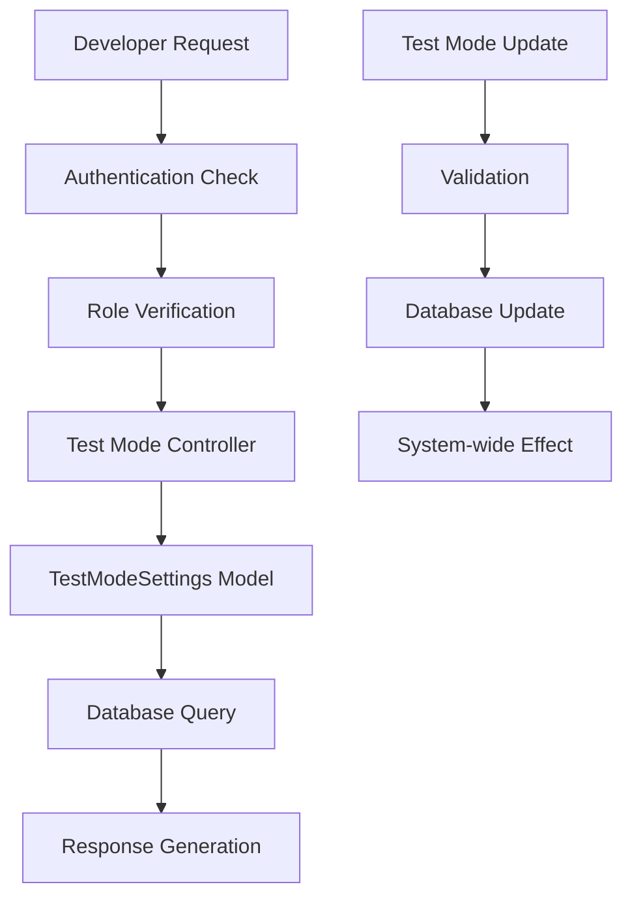
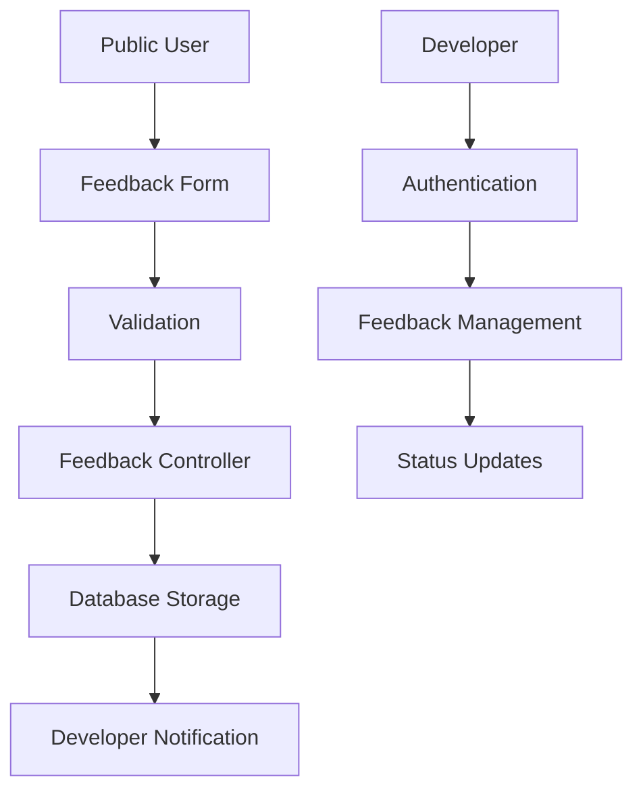
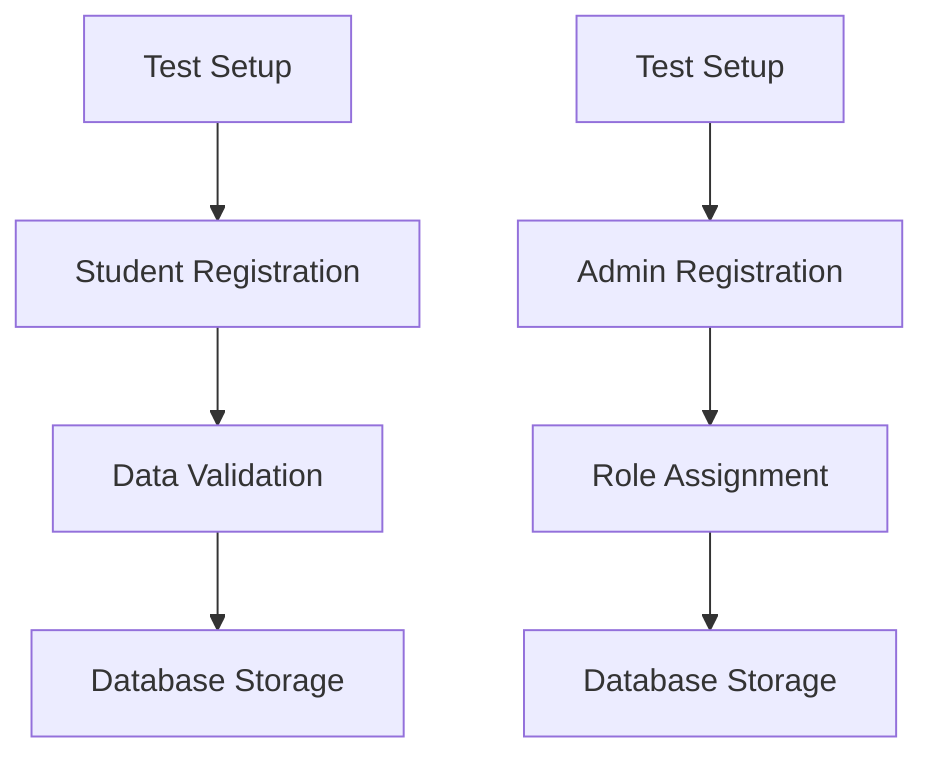

# Test Mode Implementation Documentation

## Overview

The Test Mode implementation is a comprehensive feature flag system integrated into the Registrar ODR (Online Document Request) system. It provides developers with the ability to control system behavior for testing purposes, enable feedback collection, and manage test data without affecting production operations.

## Table of Contents

1. [Purpose and Functionality](#purpose-and-functionality)
2. [Database Schema](#database-schema)
3. [Backend Implementation](#backend-implementation)
4. [API Endpoints](#api-endpoints)
5. [Data Flow and Integration](#data-flow-and-integration)
6. [Security and Access Control](#security-and-access-control)
7. [Usage and Management](#usage-and-management)
8. [Best Practices](#best-practices)
9. [Troubleshooting](#troubleshooting)

## Purpose and Functionality

### Primary Objectives

- **Feature Flag Control**: Enable/disable test mode functionality across the system
- **Feedback Collection**: Allow anonymous feedback submission during testing phases
- **Test Data Management**: Enable creation of test student and admin accounts
- **System Isolation**: Provide controlled environment for testing without production impact

### Key Features

1. **Global Test Mode Toggle**
   - Single boolean flag controls test mode state
   - Accessible only to developer role users
   - Immediate system-wide effect when changed

2. **Anonymous Feedback System**
   - Public endpoint for feedback submission
   - No authentication required (when test mode is active)
   - Support for multiple feedback types
   - Developer management interface

3. **Test Registration System**
   - Create test student accounts programmatically
   - Create test admin accounts with specified roles
   - Validation and data integrity checks
   - Developer-only access for management

4. **Comprehensive Logging**
   - All test mode activities are logged
   - Debug and monitoring support
   - Audit trail for compliance

## Database Schema

### Core Tables

#### `open_request_restriction` Table (Modified)

```sql
CREATE TABLE IF NOT EXISTS open_request_restriction (
    id SERIAL PRIMARY KEY,
    start_time TIME NOT NULL,
    end_time TIME NOT NULL,
    available_days JSONB NOT NULL,
    announcement TEXT DEFAULT '',
    test_mode BOOLEAN DEFAULT FALSE  -- NEW: Test mode flag
);
```

**Key Columns:**
- `test_mode` (BOOLEAN): Primary control flag for test mode functionality
- Default value: `FALSE` (production mode)

#### `feedback` Table

```sql
CREATE TABLE IF NOT EXISTS feedback (
    feedback_id SERIAL PRIMARY KEY,
    name VARCHAR(100) NOT NULL,
    email VARCHAR(100) NOT NULL,
    feedback_type VARCHAR(50) NOT NULL CHECK (feedback_type IN ('Bug Report', 'Feature Request', 'General Feedback')),
    description TEXT NOT NULL,
    steps_to_reproduce TEXT,
    submitted_at TIMESTAMP DEFAULT NOW(),
    status VARCHAR(20) DEFAULT 'NEW' CHECK (status IN ('NEW', 'IN PROGRESS', 'RESOLVED', 'CLOSED'))
);
```

**Key Features:**
- Supports three feedback types with specific validation
- Optional steps_to_reproduce for bug reports
- Status tracking for feedback management
- Timestamp tracking for submission analysis

#### `students` Table (Extended for Testing)

```sql
CREATE TABLE IF NOT EXISTS students (
    student_id VARCHAR(20) PRIMARY KEY,
    full_name VARCHAR(100) NOT NULL,
    contact_number VARCHAR(20),
    email VARCHAR(100),
    liability_status BOOLEAN DEFAULT FALSE,
    firstname VARCHAR(50) NOT NULL,
    lastname VARCHAR(50) NOT NULL,
    college_code VARCHAR(20)
);
```

#### `admins` Table (Extended for Testing)

```sql
CREATE TABLE IF NOT EXISTS admins (
    email VARCHAR(100) PRIMARY KEY,
    role VARCHAR(50) NOT NULL,
    profile_picture VARCHAR(500)
);
```

### Indexes and Performance

```sql
-- Feedback table indexes for fast lookups
CREATE INDEX IF NOT EXISTS idx_feedback_submitted_at ON feedback(submitted_at DESC);

-- Test mode is part of existing primary key constraint on open_request_restriction
```

## Backend Implementation

### Models

#### `TestModeSettings` Class

**Location**: `app/admin/developers/models.py`

**Purpose**: Core model for managing test mode state

```python
class TestModeSettings:
    @staticmethod
    def get_test_mode():
        """Get current test mode setting."""
        conn = g.db_conn
        cur = conn.cursor()
        try:
            cur.execute("SELECT test_mode FROM open_request_restriction WHERE id = 1")
            row = cur.fetchone()
            return bool(row[0]) if row else False
        except Exception as e:
            print(f"Error fetching test mode: {e}")
            return False
        finally:
            cur.close()

    @staticmethod
    def update_test_mode(test_mode):
        """Update test mode setting."""
        conn = g.db_conn
        cur = conn.cursor()
        try:
            cur.execute("""
                INSERT INTO open_request_restriction (id, test_mode)
                VALUES (1, %s)
                ON CONFLICT (id) DO UPDATE SET test_mode = EXCLUDED.test_mode
            """, (test_mode,))
            conn.commit()
            return True
        except Exception as e:
            conn.rollback()
            print(f"Error updating test mode: {e}")
            return False
        finally:
            cur.close()
```

**Key Features:**
- Singleton pattern (id = 1 for system-wide settings)
- Error handling with fallback to False
- Database transaction management
- Upsert pattern for safe updates

#### `Feedback` Class

**Purpose**: Manage feedback submission and retrieval

```python
class Feedback:
    @staticmethod
    def create(name, email, feedback_type, description, steps_to_reproduce=None):
        """Create new feedback entry."""
        # Implementation includes validation and error handling
        
    @staticmethod
    def get_all():
        """Get all feedback entries."""
        # Returns formatted list with timestamps
        
    @staticmethod
    def update_status(feedback_id, status):
        """Update feedback status."""
        
    @staticmethod
    def delete(feedback_id):
        """Delete feedback entry."""
```

#### `TestRegistration` Class

**Purpose**: Manage test data creation for students and admins

```python
class TestRegistration:
    @staticmethod
    def create_student(student_data):
        """Create or update student record."""
        # Validates required fields and data format
        
    @staticmethod
    def create_admin(admin_data):
        """Create or update admin record."""
        # Validates role and email format
        
    @staticmethod
    def get_student(student_id):
        """Get student by ID."""
        
    @staticmethod
    def get_admin(email):
        """Get admin by email."""
```

### Controllers

**Location**: `app/admin/developers/controller.py`

#### Test Mode Management Endpoints

```python
@developers_bp.route("/api/developers/test-mode", methods=["GET"])
@jwt_required()
@jwt_required_with_role("developer")
def get_test_mode():
    """Get current test mode setting."""
    # Returns current test mode state
    
@developers_bp.route("/api/developers/test-mode", methods=["PUT"])
@jwt_required()
@jwt_required_with_role("developer")
def update_test_mode():
    """Update test mode setting."""
    # Updates test mode state with validation
```

#### Feedback Management Endpoints

```python
@developers_bp.route("/api/developers/feedback", methods=["POST"])
def submit_feedback():
    """Submit feedback (no authentication required for test mode)."""
    # Public endpoint for feedback submission
    
@developers_bp.route("/api/developers/feedback", methods=["GET"])
@jwt_required()
@jwt_required_with_role("developer")
def get_feedback():
    """Get all feedback entries."""
    
@developers_bp.route("/api/developers/feedback/<int:feedback_id>", methods=["PUT"])
@jwt_required()
@jwt_required_with_role("developer")
def update_feedback_status(feedback_id):
    """Update feedback status."""
    
@developers_bp.route("/api/developers/feedback/<int:feedback_id>", methods=["DELETE"])
@jwt_required()
@jwt_required_with_role("developer")
def delete_feedback(feedback_id):
    """Delete feedback entry."""
```

#### Test Registration Endpoints

```python
@developers_bp.route("/api/developers/test-registration/student", methods=["POST"])
def register_student():
    """Register or update student (for test mode)."""
    # Public endpoint for test student creation
    
@developers_bp.route("/api/developers/test-registration/student/<student_id>", methods=["GET"])
@jwt_required()
@jwt_required_with_role("developer")
def get_student(student_id):
    """Get student by ID."""
    
@developers_bp.route("/api/developers/test-registration/admin", methods=["POST"])
def register_admin():
    """Register or update admin (for test mode)."""
    # Public endpoint for test admin creation
    
@developers_bp.route("/api/developers/test-registration/admin/<email>", methods=["GET"])
@jwt_required()
@jwt_required_with_role("developer")
def get_admin(email):
    """Get admin by email."""
```

## API Endpoints

### Authentication and Authorization

| Endpoint | Method | Authentication | Role Required | Description |
|----------|--------|----------------|---------------|-------------|
| `/api/developers/test-mode` | GET | Required | Developer | Get current test mode |
| `/api/developers/test-mode` | PUT | Required | Developer | Update test mode |
| `/api/developers/feedback` | POST | None | Public | Submit feedback |
| `/api/developers/feedback` | GET | Required | Developer | Get all feedback |
| `/api/developers/feedback/<id>` | PUT | Required | Developer | Update feedback status |
| `/api/developers/feedback/<id>` | DELETE | Required | Developer | Delete feedback |
| `/api/developers/test-registration/student` | POST | None | Public | Register test student |
| `/api/developers/test-registration/student/<id>` | GET | Required | Developer | Get test student |
| `/api/developers/test-registration/admin` | POST | None | Public | Register test admin |
| `/api/developers/test-registration/admin/<email>` | GET | Required | Developer | Get test admin |

### Request/Response Formats

#### Get Test Mode

**Request:**
```http
GET /api/developers/test-mode
Authorization: Bearer <jwt_token>
```

**Response:**
```json
{
  "test_mode": true
}
```

#### Update Test Mode

**Request:**
```http
PUT /api/developers/test-mode
Authorization: Bearer <jwt_token>
Content-Type: application/json

{
  "test_mode": true
}
```

**Response:**
```json
{
  "message": "Test mode updated successfully"
}
```

#### Submit Feedback

**Request:**
```http
POST /api/developers/feedback
Content-Type: application/json

{
  "name": "John Doe",
  "email": "john@example.com",
  "feedback_type": "Bug Report",
  "description": "Description of the issue",
  "steps_to_reproduce": "Step 1, Step 2, Step 3"
}
```

**Response:**
```json
{
  "message": "Feedback submitted successfully",
  "feedback_id": 123
}
```

#### Register Test Student

**Request:**
```http
POST /api/developers/test-registration/student
Content-Type: application/json

{
  "student_id": "2023123456",
  "firstname": "John",
  "lastname": "Doe",
  "contact_number": "639123456789",
  "email": "john.doe@example.com",
  "college_code": "CCS"
}
```

**Response:**
```json
{
  "message": "Student registered successfully"
}
```

## Data Flow and Integration

### Test Mode State Management



### Feedback Collection Flow



### Test Registration Flow



### Integration Points

1. **System-Wide Configuration**
   - Test mode affects multiple system behaviors
   - Integrated with request restrictions
   - Affects authentication flows

2. **Feedback System Integration**
   - Public access during test mode
   - Developer management interface
   - Status tracking and notifications

3. **Test Data Integration**
   - Student account creation for testing
   - Admin account setup for different roles
   - Data validation and integrity checks

## Security and Access Control

### Role-Based Access Control

| Feature | Developer Access | Other Roles Access | Public Access |
|---------|------------------|--------------------|---------------|
| Test Mode Toggle | ✅ Full Control | ❌ No Access | ❌ No Access |
| Test Mode Status | ✅ Read Only | ✅ Read Only | ❌ No Access |
| Feedback Submission | ✅ Full Control | ✅ Full Control | ✅ Full Control |
| Feedback Management | ✅ Full Control | ❌ No Access | ❌ No Access |
| Test Student Registration | ✅ Full Control | ✅ Full Control | ✅ Full Control |
| Test Admin Registration | ✅ Full Control | ✅ Full Control | ✅ Full Control |
| Test Data Retrieval | ✅ Full Control | ❌ No Access | ❌ No Access |

### Security Measures

1. **JWT Authentication**
   - All developer endpoints require valid JWT tokens
   - Token validation with role claims
   - Session management integration

2. **Input Validation**
   - Email format validation using regex patterns
   - Phone number format validation (639xxxxxxxxx)
   - Required field validation
   - SQL injection prevention through parameterized queries

3. **Database Security**
   - Connection pooling with proper cleanup
   - Transaction management with rollback on failure
   - Error handling without information disclosure

4. **Rate Limiting Considerations**
   - Feedback submission should include rate limiting
   - Test registration endpoints may need throttling
   - Developer endpoints have implicit protection through authentication

### Data Privacy

1. **Feedback Data**
   - Stores personal information (name, email)
   - No sensitive data collection
   - Deletion capability for privacy compliance

2. **Test Data**
   - Separate from production data
   - Clear identification as test data
   - Deletion and cleanup procedures

## Usage and Management

### Developer Operations

#### Enabling Test Mode

1. **Via API Call**
```bash
curl -X PUT /api/developers/test-mode \
  -H "Authorization: Bearer <jwt_token>" \
  -H "Content-Type: application/json" \
  -d '{"test_mode": true}'
```

2. **Via Database Direct** (Emergency Only)
```sql
UPDATE open_request_restriction SET test_mode = true WHERE id = 1;
```

#### Managing Feedback

1. **View All Feedback**
   - Access developer dashboard
   - Navigate to feedback management
   - Filter by status, type, or date

2. **Update Feedback Status**
   - New → In Progress → Resolved → Closed
   - Add internal notes for tracking
   - Developer-only operations

3. **Delete Feedback**
   - Remove outdated or spam feedback
   - Permanent deletion from database

#### Managing Test Data

1. **Student Test Accounts**
   - Create with valid student ID format
   - Use realistic but fake contact information
   - Associate with test college codes

2. **Admin Test Accounts**
   - Create with valid email addresses
   - Assign appropriate test roles
   - Use different roles for different test scenarios

### Monitoring and Logging

#### System Logs

1. **Test Mode Changes**
   - Logged with developer identity
   - Includes old and new values
   - Timestamp and IP address

2. **Feedback Submissions**
   - Public submissions logged
   - Includes user agent and IP
   - Error logging for failed submissions

3. **Test Registration Activities**
   - All test data creation logged
   - Developer-initiated actions tracked
   - Validation failures logged

#### Database Monitoring

```sql
-- Check current test mode status
SELECT test_mode, updated_at FROM open_request_restriction WHERE id = 1;

-- Monitor feedback submissions
SELECT feedback_type, status, submitted_at 
FROM feedback 
ORDER BY submitted_at DESC;

-- Check test data volume
SELECT 
  (SELECT COUNT(*) FROM students WHERE student_id LIKE 'TEST%') as test_students,
  (SELECT COUNT(*) FROM admins WHERE email LIKE '%@test.%') as test_admins;
```

## Best Practices

### Development Workflow

1. **Test Mode Activation**
   - Always activate test mode before development testing
   - Document the reason for activation
   - Set up monitoring for test activities

2. **Feedback Collection**
   - Encourage thorough feedback during test phases
   - Respond promptly to critical feedback
   - Use feedback to improve user experience

3. **Test Data Management**
   - Use consistent naming conventions for test data
   - Clean up test data after testing phases
   - Avoid creating production-like test accounts

### Production Considerations

1. **Test Mode Security**
   - Never leave test mode enabled in production
   - Regular audits of test mode status
   - Implement alerts for unexpected test mode changes

2. **Data Privacy**
   - Review feedback data regularly
   - Implement data retention policies
   - Ensure GDPR/privacy compliance

3. **Performance Monitoring**
   - Monitor feedback submission rates
   - Check database performance during test phases
   - Log and alert on unusual activities

### Testing Best Practices

1. **Automated Testing**
   - Include test mode functionality in test suites
   - Test both enabled and disabled states
   - Validate security boundaries

2. **Manual Testing**
   - Test all endpoints with proper authentication
   - Verify public endpoints work correctly
   - Test error handling and edge cases

3. **Integration Testing**
   - Test interaction with other system components
   - Verify logging and monitoring integration
   - Test cleanup procedures

## Troubleshooting

### Common Issues

#### Test Mode Not Responding

**Symptoms:**
- Test mode status not changing
- API returns errors
- No system-wide effect

**Diagnosis:**
```sql
-- Check database connectivity
SELECT test_mode FROM open_request_restriction WHERE id = 1;

-- Check application logs
SELECT * FROM logs WHERE action LIKE '%test_mode%' ORDER BY timestamp DESC;
```

**Solutions:**
1. Verify database connection
2. Check developer role permissions
3. Restart application if necessary
4. Review application logs for errors

#### Feedback Submission Failures

**Symptoms:**
- Public users cannot submit feedback
- API returns 500 errors
- Missing feedback entries

**Diagnosis:**
1. Check database connectivity
2. Verify table structure
3. Review validation rules
4. Check application logs

**Solutions:**
1. Verify `feedback` table exists and has correct structure
2. Check database permissions
3. Review validation logic
4. Test with minimal feedback data

#### Test Registration Issues

**Symptoms:**
- Cannot create test accounts
- Validation errors
- Database constraint violations

**Diagnosis:**
```sql
-- Check if test data already exists
SELECT * FROM students WHERE student_id LIKE 'TEST%';
SELECT * FROM admins WHERE email LIKE '%@test.%';
```

**Solutions:**
1. Use unique identifiers for test data
2. Verify all required fields are provided
3. Check database constraints
4. Use appropriate test college codes

### Error Codes

| HTTP Code | Error Type | Description | Resolution |
|-----------|------------|-------------|------------|
| 400 | Bad Request | Missing required fields | Check request payload |
| 401 | Unauthorized | Invalid or missing JWT | Re-authenticate |
| 403 | Forbidden | Insufficient role permissions | Check user role |
| 404 | Not Found | Resource doesn't exist | Verify identifiers |
| 500 | Internal Server Error | Database or system error | Check logs and database |

### Debugging Procedures

1. **Enable Debug Logging**
   - Increase log level for developers
   - Monitor test mode changes
   - Track all API calls

2. **Database Inspection**
   - Verify table structures
   - Check data integrity
   - Monitor query performance

3. **API Testing**
   - Use tools like Postman or curl
   - Test authentication flows
   - Verify request/response formats

### Support and Maintenance

1. **Regular Maintenance**
   - Clean up old test data
   - Archive old feedback
   - Review system logs

2. **Performance Optimization**
   - Monitor feedback submission rates
   - Optimize database queries
   - Review indexes and constraints

3. **Security Audits**
   - Regular role permission reviews
   - Test mode access monitoring
   - Data privacy compliance checks

---

## Conclusion

The Test Mode implementation provides a robust framework for controlled testing within the Registrar ODR system. It balances functionality with security, enabling comprehensive testing while maintaining system integrity. Regular monitoring, proper usage patterns, and adherence to best practices ensure optimal performance and security.
